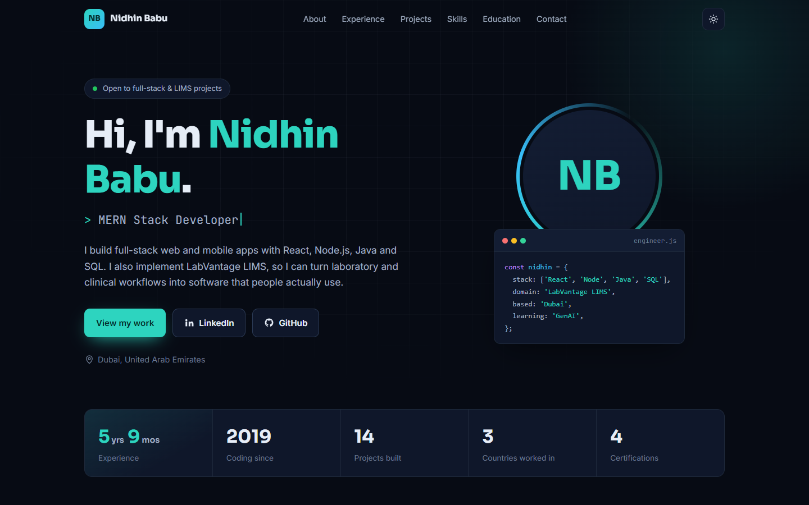
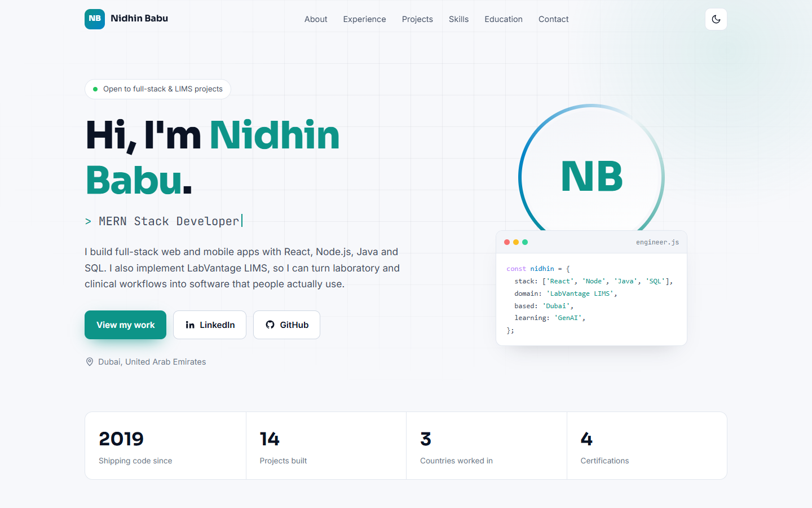
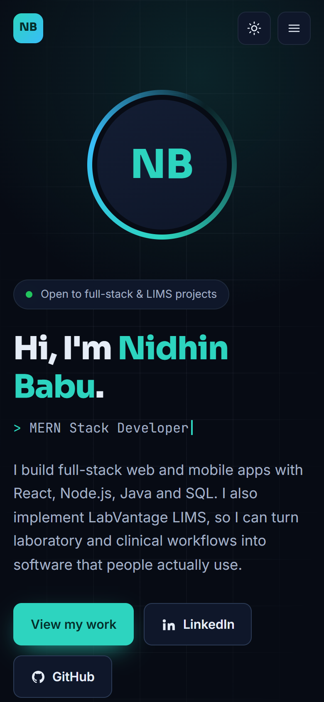
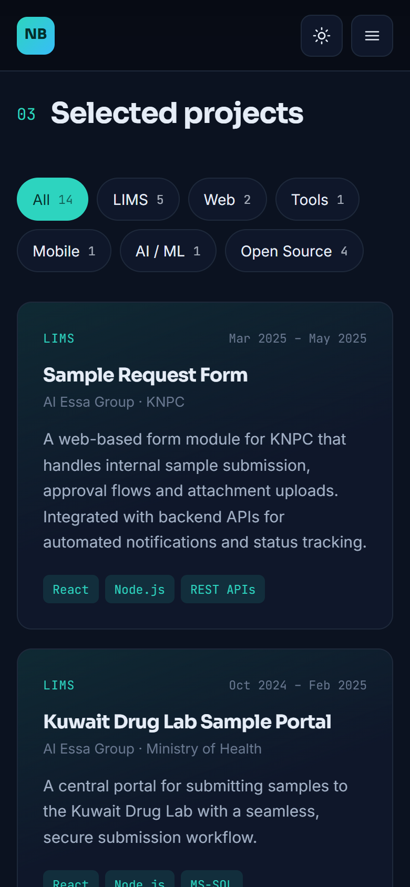
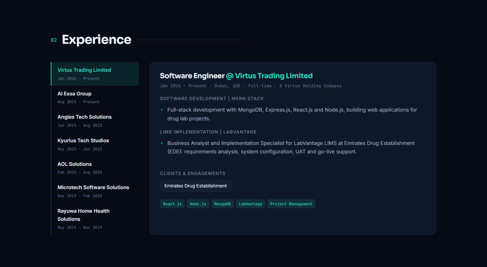
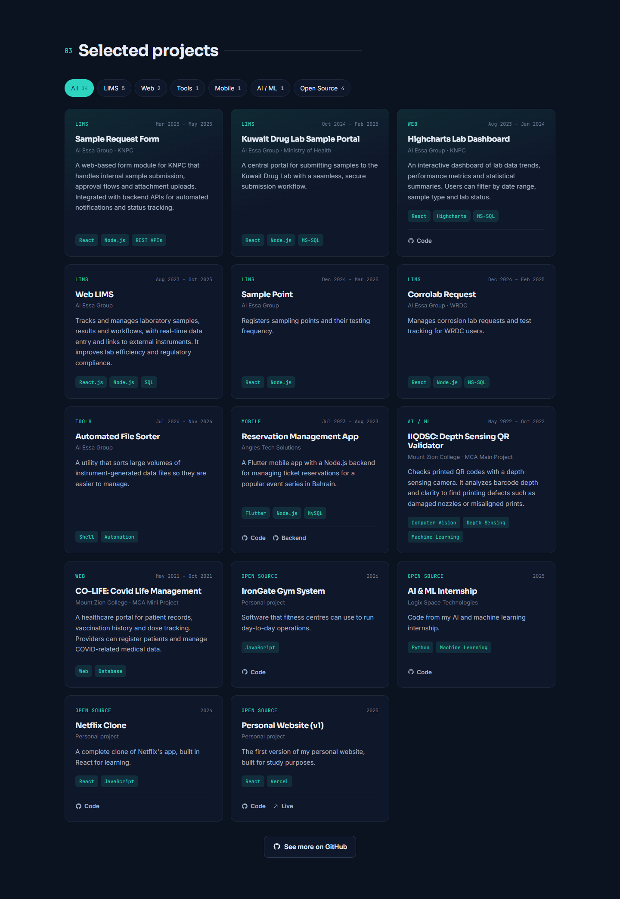
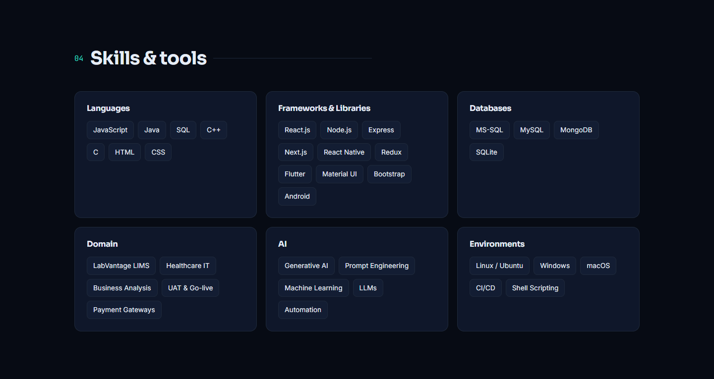
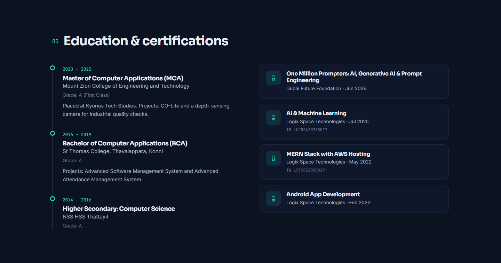

# Nidhin Babu | Portfolio

**Software Engineer · MERN Stack Developer · LIMS Implementation Specialist**
Dubai, United Arab Emirates

[](https://nidhinbabu44.github.io/portfolio/)
[](https://www.linkedin.com/in/nidhinbabu44/)
[](https://github.com/nidhinbabu44/portfolio/actions)

### 🌐 Live site: **[nidhinbabu44.github.io/portfolio](https://nidhinbabu44.github.io/portfolio/)**

This is my personal portfolio website, built with **React 19** and **Vite** and deployed to **GitHub Pages**. I build full-stack web and mobile apps with React, Node.js, Java and SQL. I also implement LabVantage LIMS, turning laboratory and clinical workflows into software that people actually use.



---

## Screenshots

| Light mode | Mobile |
| --- | --- |
|  |   |

**Experience:** one tab per employer, with responsibilities, clients and tech stack



**Projects:** filter by LIMS, Web, Tools, Mobile, AI/ML or Open Source, with links to the code



**Skills**



**Education & certifications**



---

## Experience

### Software Engineer: Virtus Trading Limited (A Virtus Holding Company)
*Jan 2026 – Present · Dubai, UAE · Full-time*

- **Software Development | MERN Stack:** full-stack development with MongoDB, Express.js, React.js and Node.js, building web applications for drug lab projects.
- **LIMS Implementation | LabVantage:** Business Analyst and Implementation Specialist for LabVantage LIMS at **Emirates Drug Establishment (EDE)**: requirements analysis, system configuration, UAT and go-live support.

### Software Engineer (LIMS Specialist), Full Stack: Al Essa Group
*Aug 2023 – Present · Kuwait · Full-time*

- Developed and maintained full-stack web applications using React.js (Redux, Hooks, Context API) and Node.js (Express).
- Integrated the **KNET payment gateway** into a customer-facing web portal, enabling secure end-to-end online transactions.
- Designed and optimized **MS-SQL** databases: complex queries, stored procedures, query tuning and indexing.
- Extended LIMS functionality with custom Action classes in **Core Java** for seamless system integrations.
- Automated network-to-server file mapping with custom shell scripts, reducing manual effort and errors.
- Partnered with QA and DevOps to support CI/CD pipelines and stabilize deployment environments.
- Administered server operations: log monitoring, health checks, maintenance and remote access for internal users.

**Clients & engagements:** Ministry of Health (Kuwait Drug Control Sample Portal) · Ministry of Interior (Marshal App) · Ministry of Electricity & Water (LIMS Balancing)

### Flutter Developer Intern: Angles Tech Solutions
*Jun 2023 – Aug 2023 · Kerala, India · Remote*

- Developed a full-stack Reservation Management mobile app with Flutter on the frontend and Node.js + MySQL on the backend, covering the end-to-end booking workflow.

### Associate Software Engineer: Kyurius Tech Studios
*May 2022 – Jun 2023 · Bengaluru, India · Full-time*

- Built responsive, high-performance interfaces with React.js, Next.js and React Native across web and mobile.
- Integrated RESTful APIs and implemented robust client-side validation for data integrity.
- Optimized performance and cross-browser compatibility, improving load times and UI consistency.
- Delivered UI/UX enhancements that improved usability and visual polish.

**Clients:** CLO Technologies · Art Of Living · Chempure

### Java Developer Intern: AOL Solutions
*Feb 2020 – Aug 2020 · Kerala, India*

- Developed and maintained ERP software solutions in Core Java supporting critical business operations.

### Android Developer Intern: Microtech Software Solutions
*Dec 2019 – Feb 2020 · Kerala, India*

- Built native Android apps in Android Studio (Java) with SQLite for reliable local data management.

### Web Developer: Rayuwa Home Health Solutions
*May 2019 – Nov 2019 · Bengaluru, India*

- Designed and developed responsive pages with Bootstrap and CSS Flexbox, working mobile-first.
- Coordinated with backend teams for seamless API integration and deployments.

---

## Selected projects

| Project | Where | Stack |
| --- | --- | --- |
| Sample Request Form | Al Essa Group · KNPC | React, Node.js, REST APIs |
| Kuwait Drug Lab Sample Portal | Al Essa Group · Ministry of Health | React, Node.js, MS-SQL |
| [Highcharts Lab Dashboard](https://github.com/nidhinbabu44/HighChartApp) | Al Essa Group · KNPC | React, Highcharts, MS-SQL |
| Web LIMS | Al Essa Group | React.js, Node.js, SQL |
| Sample Point | Al Essa Group | React, Node.js |
| Corrolab Request | Al Essa Group · WRDC | React, Node.js, MS-SQL |
| Automated File Sorter | Al Essa Group | Shell, Automation |
| [Reservation Management App](https://github.com/nidhinbabu44/ReservationApp_Flutter) ([backend](https://github.com/nidhinbabu44/Reservation_Backend)) | Angles Tech Solutions | Flutter, Node.js, MySQL |
| IIQDSC: Depth Sensing QR Validator | MCA main project | Computer Vision, Machine Learning |
| CO-LIFE: Covid Life Management | MCA mini project | Web, Database |
| [IronGate Gym System](https://github.com/nidhinbabu44/irongate-gym-system) | Personal | JavaScript |
| [AI & ML Internship](https://github.com/nidhinbabu44/AI-ML_Intership) | Logix Space Technologies | Python, Machine Learning |
| [Netflix Clone](https://github.com/nidhinbabu44/NetFlix-App) | Personal | React |
| [Personal Website (v1)](https://github.com/nidhinbabu44/My_Portfolio) | Personal | React, Vercel |

## Skills

- **Languages:** JavaScript, Java, SQL, C++, C, HTML, CSS
- **Frameworks & libraries:** React.js, Node.js, Express, Next.js, React Native, Redux, Flutter, Material UI, Bootstrap, Android
- **Databases:** MS-SQL, MySQL, MongoDB, SQLite
- **Domain:** LabVantage LIMS, Healthcare IT, Business Analysis, UAT & Go-live, Payment Gateways
- **AI:** Generative AI, Prompt Engineering, Machine Learning, LLMs, Automation
- **Environments:** Linux / Ubuntu, Windows, macOS, CI/CD, Shell Scripting

## Education & certifications

- **Master of Computer Applications (MCA):** Mount Zion College of Engineering and Technology, 2020 – 2022, Grade A (First Class)
- **Bachelor of Computer Applications (BCA):** St Thomas College, Thavalappara, Konni, 2016 – 2019, Grade A
- **One Million Prompters: AI, Generative AI & Prompt Engineering:** Dubai Future Foundation, Jun 2026
- **AI & Machine Learning:** Logix Space Technologies, Jul 2025
- **MERN Stack with AWS Hosting:** Logix Space Technologies, May 2022
- **Android App Development:** Logix Space Technologies, Feb 2022

---

## About this site

- **Live:** https://nidhinbabu44.github.io/portfolio/
- **Stack:** React 19 and Vite 7, with plain CSS. It uses no UI library, and its only dependencies are `react` and `react-dom`.
- **Features:**
  - Dark and light themes, with your choice remembered.
  - Responsive layout with a mobile menu.
  - Tabbed experience section.
  - Project filters.
  - Sections that fade in as you scroll.
  - Respects reduced-motion settings.
- **Content:** everything on the page comes from one file, [`src/data/profile.js`](src/data/profile.js).
- **Deployment:** every push to `main` is built and published by [GitHub Actions](.github/workflows/deploy.yml).

### Run locally

```bash
npm install
npm run dev      # http://localhost:5190
npm run build    # production build in dist/
```

### Project structure

```
src/
├── data/profile.js      # all site content
├── components/          # Nav, Hero, About, Experience, Projects, Skills, Education, Contact
├── hooks/useReveal.js   # scroll-in animations
├── utils/asset.js       # resolves /public files against the Pages base path
└── index.css            # theme tokens and styles
```

---

© Nidhin Babu
